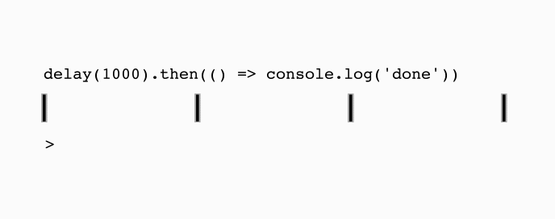
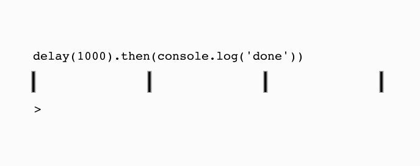
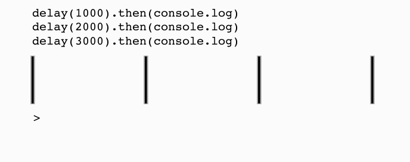
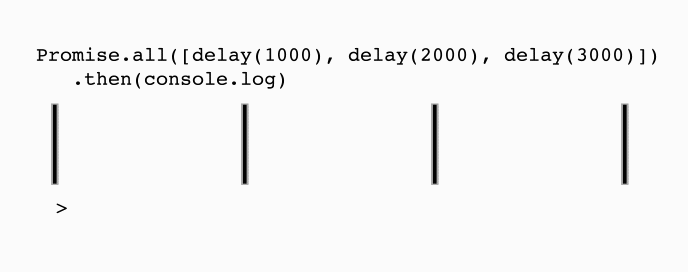

In order to visualize how Promises execute, let's define a new method `delay(millisecs)`.

```js
function delay(millisecs) {
  return new Promise(resolve => {
    setTimeout(() => resolve(millisecs), millisecs);
  });
}
```

This is a utility method which will resolve once the timeout has passed.

The delay in milliseconds will be passed to `.then`'s callback.

Let's look at 4 examples (with animated timelines).

## Example #1/4

This shows how `console.log()`'s execution will be delayed by `delay(msec)`.

```js
delay(1000).then(() => console.log("done"));
```



<!-- ```
delay(1000) --------|.then(fn)
                    | console.log('done')
|-------------------|--------------------|--------------------|-----------------
0msec             1sec                 2sec                 3sec
``` -->

## Example #2/4

_This shows a common mistake._

The `console.log` fires right when the `delay(1000)` **begins**. Not **after** the delay like you probably wanted.

Because `console.log` returns `undefined` our `.then()` is silently ignored.

Note the difference between `typeof console.log === 'function'` vs. `typeof console.log() === undefined`.

Generally the desired usage for `console.log` is shown in Example #1. Make sure you pass functions into `.then` and `.catch`.

```js
delay(1000).then(console.log("done"));
```



<!-- ```
delay(1000) --------|.then(null)
console.log('done')
|-------------------|--------------------|--------------------|-----------------
0msec             1sec                 2sec                 3sec
``` -->

## Example #3/4

3 Promises execute simultaneously.

```js
delay(1000).then(console.log);
delay(2000).then(console.log);
delay(3000).then(console.log);
```



<!-- ```
delay(1000) ------|.then(console.log)
delay(2000) ------|--------------------|.then(console.log)
delay(3000) ------|--------------------|--------------------|.then(console.log)
|-----------------|--------------------|--------------------|-------------------
|                 |                    |                    |
0msec           1sec                 2sec                 3sec
``` -->

## Example #4/4

`Promise.all` with 3 `delay` Promises. They will execute simultaneously.

```js
Promise.all([delay(1000), delay(2000), delay(3000)]).then(console.log);
```



<!--
```
delay(1000) ---| [resolved]------------------v
delay(2000) ---|--------------| [resolved]---v
delay(3000) ---|--------------|--------------v [resolved]
Promise.all()  |--------------|-------------- > console.log([1000, 2000, 3000])
|--------------|--------------|--------------|--------------------------------
|              |              |              |
0msec        1sec           2sec           3sec
```
-->

> Credits:
>
> - Animated async diagrams by [Patrick Biffle](https://github.com/Piglacquer)
> - Inspiration for this article: https://pouchdb.com/2015/05/18/we-have-a-problem-with-promises.html

<!-- <div class="challenge" title="Question #1: Meaning of life:">
  <ul class="options">
    <li>1</li>
    <li>2</li>
    <li class="answer">42</li>
    <li>3</li>
  </ul>
  <div class="description">What is the meaning of life?</div>
</div> -->
