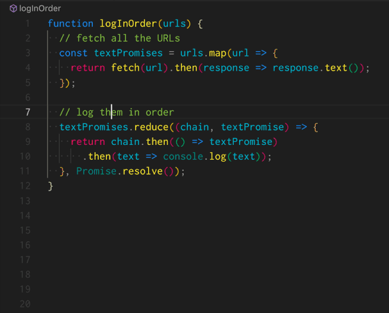
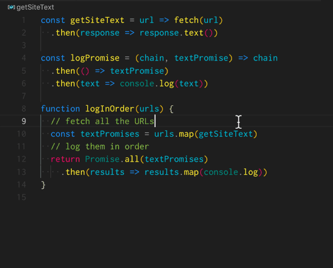

Since the beginning of time, developers have fought many silly fights. From the classic _"Tabs vs. Spaces"_ to the timeless _"Mac vs. PC"_ debate, we're good at finding distracting arguments.
<br />
<small>_Answers:_ Linux & Spaces.</small>

<!-- We're going to look at 2 rules to improve your life with Promises. -->


## The Fight...?

### Promises vs. Async/Await!

Wait, is this a fight? It must be right? We don't seem to talk about callbacks anymore?

No, it's not a fight. Ultimately it's another potential tool in your toolbox. However, because `async`/`await` doesn't replace all Promise functionality (specifically `Promise.all`, `.race`) **it's misleading presenting it as a replacement.**

There's a lot of influential people promoting this misconception `async`/`await` is the Promises [replacement](https://developers.google.com/web/fundamentals/primers/async-functions) [everyone's](https://hackernoon.com/6-reasons-why-javascripts-async-await-blows-promises-away-tutorial-c7ec10518dd9) [been](https://twitter.com/umaar/status/1045655069478334464) [waiting](http://2ality.com/2017/08/promise-try.html#why-not-just-use-async-functions) [for](https://dzone.com/articles/javascript-promises-and-why-asyncawait-wins-the-ba).

> **Hint: No, nope, and not even a little.**


A recent addition to VS Code advances this bias. As [@umaar](https://twitter.com/umaar) tweeted:

<blockquote class="twitter-tweet" data-lang="en"><p lang="en" dir="ltr">Visual Studio Code can now convert your long chains of Promise.then()&#39;s into async/await! 🎊 Works very well in both JavaScript and TypeScript files. .catch() is also correctly converted to try/catch ✅ <a href="https://t.co/xb39Lsp84V">pic.twitter.com/xb39Lsp84V</a></p>&mdash; Umar Hansa (@umaar) <a href="https://twitter.com/umaar/status/1045655069478334464?ref_src=twsrc%5Etfw">September 28, 2018</a></blockquote>

<!-- Sure, it's an impressive addition to an already amazing list of features. -->

If you hate Promises, and want this refactoring feature, I don't blame you.
<br />
_I empathize. I understand._
<br />
I've been there. 🤗

<br />

I used to hate Promises. Today, I have come back around completely. **Promises are amazing.** They can enable/encourage you to **take advantage of function composition.**

There are 2 areas I recommend focusing on first to advance your Promise technique.

1. [Named functions (no anonymous)](#rule-1)
1. [Single-purpose functions](#rule-2)

<h2 id="rule-1">#1: Named Functions!</h2>

Kill your anonymous methods. Using **named functions** makes code read like poetry of your requirements.

Let's look at a common example:

Making an HTTP GET request using `fetch`:

<!-- the fetch specification states [HTTP status codes](https://http.cat/) over 400 or 500 **do not automatically trigger an error.** The default in many AJAX libraries (jQuery, axios). -->

<!-- Before we see the solution, look over a common "recommended" implementation: -->

### Anti-Pattern

```js
// ❌ Using anonymous inline functions 💩
fetch(url)
  .then(response => response.status < 400
    ? response
    : Promise.reject(new Error('Request Failed: ' + response.ststus)))
  .then(response => response.text())
```

### Solution: Named Methods

```js
// ✅ Clarity emerges: named functions
fetch(url)
  .then(checkResponse)
  .then(getText)


// Reusable general-purpose functions
function checkResponse(response) {
  return response.status < 400
    ? response
    : Promise.reject(new Error('Request Failed: ' + response.ststus))
}
function getText(response) {
  return response.text()
}
```

> The benefits of this approach are increasingly apparent as you get DRY-er code.

**Additional Resources:** Check out my **1 minute videos** of [basic logging](https://www.youtube.com/xR_MZE1SIkk) and [advanced debugging](https://www.youtube.com/P_tghqWj72M) using this technique.

<h2 id="rule-2">#2: Single Purpose (Functions)</h2>

It sounds _deceptively precise_: Single Purpose.

Yet it's so subjective, arbitrary, and sure, sometimes even meaningless.

<!-- Instead of arguing if a given function is sufficiently focused.

I came up with a rough measure for this: `Purpose Cost`. The higher the score, more likely it's doing too much.

```js
// 1 point: the return & ternary are effectively a one-liner
function checkResponse(response) {
  return response.status < 400
    ? response
    : Promise.reject(new Error('Request Failed: ' + response.ststus))
}
// 1 point: the return & expression are also effectively a one-liner
function getText(response) {
  return response.text()
}
```

Given a function's code, add 1 point for every line containing any of: `if`, `return`, ternary, `for`, `const`, `let`, `var`, `switch`, `while`, `[].map/filter/reduce/etc`. Add 1 point for each instruction (ignore extra lines from whitespace). A number of chained expressions or methods only count for 1 point.

Whew, that was a bit of jargon.
 -->

Interestingly, most developers report they are _pretty dang good_ at **Single Purpose**'ing their code. Not unrelated: they report being great drivers too!

<!-- This **isn't a unique issue with Promises**, array methods and all other HoF-based (Higher Order Function) APIs have the same ergonomics. -->

Let's look at an example the (incredibly talented) [Jake Archibald](https://twitter.com/jaffathecake) features in his [async/await article for the Google Developers site](https://developers.google.com/web/fundamentals/primers/async-functions).

<!--
Let's look at one of the so called "❌ Not recommended" Promise examples. (The description is "say we wanted to fetch a series URLs and log them as soon as possible, in the correct order.") -->

```js
// source: https://developers.google.com/web/fundamentals/primers/async-functions
function logInOrder(urls) {
  // fetch all the URLs
  const textPromises = urls.map(url => {
    return fetch(url).then(response => response.text());
  });

  // log them in order
  textPromises.reduce((chain, textPromise) => {
    return chain.then(() => textPromise)
      .then(text => console.log(text));
  }, Promise.resolve());
}
```

### Single Purpose?

I'd say no. What's `logInOrder` doing?

1. loop through a list of `urls`
1. apply them to an inline HTTP GET:
  1. HTTP `fetch`
  1. return response text body
1. append a `.then(text => console.log(text))` after each promise in `textPromise`
  1. print results serially

There are 5 anonymous methods defined in this single function. As Jake even points out, the `.reduce` is too complex. It doesn't make sense to hand-write nuanced mechanisms all over your code. Put another way, we don't write DOM creation code with endless `document.createElement()`, `element.setAttribute()`, etc. Instead we choose the best tool out of many options: helper/utility functions, libraries or frameworks.

<!-- We need to isolate each 'step' that's going on: there's an HTTP request, a transform for a list of URLs into a list of results. Also a `console.log` is needed. -->

<!-- > 🤔 Why do `Promises` cause developers to abandon practices we use elsewhere? -->

<!-- **Note:** If the intention was to _initiate requests_ in a sequence, instead of merely printing the results out in order, this code doesn't actually do that. We'll refactor accordingly. -->


#### Solution: Single Purpose Functions

### Begin by **extracting methods**...



### Continue by replacing the `.reduce()` and `logPromise()` with a `Promise.all` and a `..map()`...




### Summary

Try apply these techniques to your own code! Then [tweet at me](https://twitter.com/justsml) & let me know how it went. Or if you have questions or comments, reach out as well!

Help spread the #PromiseTruth & share this article. ❤️

#### Related Reading

* [Daniel Brain](https://medium.com/@bluepnume/even-with-async-await-you-probably-still-need-promises-9b259854c161)
* [Eric Elliott](https://twitter.com/_ericelliott?lang=en)
